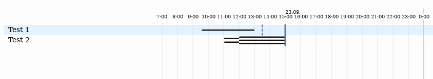

# SVGTimePlanner
Generate svg timeplans from JSON in the browser

Currently a time scale of hours and days is supported. You can add a list of tasks, designate time slots for them and set deadlines.

JSON-data from the body of a div with `class="SVGTimePlanner"` is autoloaded. For example:

    

    {
      "tasks": [
        {
          "name": "Test 1",
          "slots": [
            { "from": "2017-09-23T09:34", "to": "2017-09-23T13:00" }
          ],
          "deadlines": [
            { "at": "2017-09-23T13:30", "type": "Soft" }
          ]
        },
        {
          "name": "Test 2",
          "slots": [
            { "from": "2017-09-23T11:02", "to": "2017-09-23T12:00", "effort": 2 },
            { "from": "2017-09-23T12:00", "to": "2017-09-23T15:00", "effort": 3 }
          ]
        }
      ],
      "deadlines": [
        {
          "at": "2017-09-23T15:00",
          "tasks": [0, 1]
        }
      ]
    }
    

Results in the following (cut-out):

